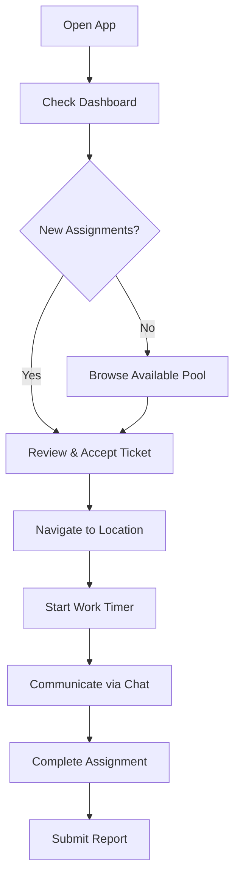

# 🔧 Net Covet TT Mobile App
<div align="center">
  


*A robust and feature-rich mobile application designed for field engineers to efficiently manage assignments, communicate in real-time, and track their work on the go.*

[Features](#-features) • [Installation](#-installation) • [Usage](#-usage) • [API Documentation](#-api-configuration) • [Contributing](#-contributing)

</div>

---

## 🎯 Overview

The Field Engineer Mobile App is a comprehensive solution built with React Native and Expo that empowers field engineers to:

- 📋 Manage work assignments efficiently
- 💬 Communicate in real-time with team members
- 📍 Track location and work progress
- 💰 Monitor earnings and payment history
- 📱 Work seamlessly across iOS and Android platforms

---

## ✨ Features

### 🔐 **Authentication & Security**
- Secure login, registration, and password reset
- JWT token management with `expo-secure-store`


### 🏠 **Dashboard & Overview**
- Real-time dashboard with key metrics
- Pending ticket assignments overview
- Quick access to all major app sections
- Work progress tracking

### 🎫 **Advanced Ticket Management**
| Feature | Description |
|---------|-------------|
| **Pending Assignments** | Accept or reject directly assigned tickets |
| **Available Pool** | Browse and claim tickets from shared pool |
| **Active Ticket View** | Manage current assignment with detailed info |
| **Complete History** | Review all completed work with search & filters |

### 💬 **Real-Time Communication**
- **Socket.IO powered** instant messaging
- **Multi-media support**: Text, images, PDF attachments
- **Threaded conversations** with reply-to functionality
- **Typing indicators** and read receipts
- **Offline message sync** when connection restored

### 🛰️ **Smart Location Tracking**
- **Background location tracking** during active tickets
- **Battery-optimized** tracking with `expo-location`
- **Geofencing capabilities** for job site verification
- **Location history** for completed assignments

### 👤 **Profile & Financial Management**
- Personal profile management
- **Certificate storage** and verification
- **Payout tracking** with detailed history
- **Performance analytics** and ratings

### 🎨 **Modern UI/UX**
- **NativeWind** styling (Tailwind CSS for React Native)
- **React Native Paper** components
- **Dark/Light theme** support
- **Accessibility compliant** design
- **Smooth animations** and transitions

---

## 🛠️ Tech Stack

<table>
<tr>
<td>

**Core Framework**
- React Native
- Expo SDK 53
- JavaScript

</td>
<td>

**Navigation & State**
- React Navigation v6
- React Context API
- AsyncStorage

</td>
</tr>
<tr>
<td>

**Communication**
- Axios (HTTP requests)
- Socket.IO Client
- Push Notifications

</td>
<td>

**UI & Styling**
- NativeWind
- React Native Paper
- React Native Vector Icons

</td>
</tr>
<tr>
<td>

**Device Features**
- expo-location
- expo-task-manager
- expo-secure-store

</td>
<td>

**Development**
- ESLint
- Prettier
- React Native Debugger

</td>
</tr>
</table>

---

## 🚀 Installation

### Prerequisites

Before you begin, ensure you have the following installed:

- **Node.js** (v16 or higher) - [Download here](https://nodejs.org/)
- **npm** or **yarn** package manager
- **Expo CLI**: `npm install -g @expo/cli`
- **Mobile Device** with Expo Go app OR emulator/simulator

### Quick Start

1. **Clone the repository**
   ```bash
   git clone https://github.com/sharifShaikh1/FieldEnginAndroid.git
   cd FieldEnginAndroid
   ```

2. **Install dependencies**
   ```bash
   npm install
   # or
   yarn install
   ```

3. **Configure API endpoint**
   
   Edit `config/apiConfig.js`:
   ```javascript
   const locations = {
     DEVELOPMENT: 'http://192.168.1.100:8021',  // Your local IP
     STAGING: 'https://staging-api.yourapp.com',
     PRODUCTION: 'https://api.yourapp.com'
   };

   // Change this to match your environment
   const CURRENT_LOCATION = 'DEVELOPMENT';
   
   export const API_BASE_URL = locations[CURRENT_LOCATION];
   ```

4. **Start the development server**
   ```bash
   npx expo start
   ```

5. **Run on device/emulator**
   - **Physical Device**: Scan QR code with Expo Go app
   - **Android Emulator**: Press `a` in terminal
   - **iOS Simulator**: Press `i` in terminal

### Environment Variables

Create a `.env` file in the root directory:

```env
API_BASE_URL=http://your-backend-url:8021
SOCKET_URL=ws://your-backend-url:8021
SENTRY_DSN=your-sentry-dsn-here
MAPS_API_KEY=your-google-maps-api-key
```

---

## 📱 Usage

### First Time Setup

1. **Register Account**: Create a new field engineer account
2. **Complete Profile**: Add personal information and upload certificates
3. **Enable Permissions**: Allow location and notification access
4. **Start Working**: Browse available tickets and begin your first assignment

### Daily Workflow



### Key App Sections

| Screen | Description | Key Features |
|--------|-------------|--------------|
| 🏠 **Dashboard** | Main overview screen | Active tickets, pending assignments, earnings |
| 🎫 **Tickets** | Assignment management | Browse, accept, track, complete tickets |
| 💬 **Chat** | Real-time communication | Text, media, threaded conversations |
| 📍 **Location** | GPS tracking | Background tracking, route history |
| 👤 **Profile** | Account management | Personal info, certificates, settings |
| 💰 **Payouts** | Financial overview | Earnings, payment history, invoices |

---

## 🏗️ Project Structure
```
 mobile-app/                                                                                                                         
 ├── .expo/                                                                                                                          
 │   ├── devices.json                                                                                                                
 │   └── README.md                                                                                                                   
 ├── assets/                                                                                                                         
 │   ├── adaptive-icon.png                                                                                                           
 │   ├── favicon.png                                                                                                                 
 │   ├── icon.png                                                                                                                    
 │   └── splash-icon.png                                                                                                             
 ├── components/                                                                                                                     
 │   ├── ActiveTicketCard.jsx                                                                                                       
 │   ├── ChatMessageBubble.jsx                                                                                                       
 │   ├── IdCard.jsx                                                                                                                  
 │   ├── ImageViewer.jsx                                                                                                             
 │   ├── PendingAssignmentCard.jsx                                                                                                   
 │   ├── SkeletonLoader.jsx                                                                                                          
 │   ├── StatCard.jsx                                                                                                                
 │   ├── TestComponent.jsx                                                                                                           
 │   └── TicketCard.jsx                                                                                                              
 ├── config/                                                                                                                         
 │   └── apiConfig.js                                                                                                                
 ├── context/                                                                                                                        
 │   ├── AuthContext.jsx                                                                                                             
 │   └── SocketContext.jsx                                                                                                           
 ├── navigators/                                                                                                                     
 │   └── AppNavigator.jsx                                                                                                            
 ├── screens/                                                                                                                        
 │   ├── AvailableTicketsScreen.jsx                                                                                                  
 │   ├── CertificateDetailScreen.jsx                                                                                                 
 │   ├── CertificatesScreen.jsx                                                                                                      
 │   ├── ChatScreen.jsx                                                                                                              
 │   ├── ForgotPasswordScreen.jsx                                                                                                    
 │   ├── HomeScreen.jsx                                                                                                              
 │   ├── LoginScreen.jsx                                                                                                             
 │   ├── ParticipantListScreen.jsx                                                                                                   
 │   ├── PaymentsScreen.jsx                                                                                                          
 │   ├── PayoutsScreen.jsx                                                                                                           
 │   ├── ProfileScreen.jsx                                                                                                           
 │   ├── RegisterScreen.jsx                                                                                                          
 │   ├── ResetPasswordScreen.jsx                                                                                                     
 │   ├── TicketChatScreen.jsx                                                                                                        
 │   └── TicketHistoryScreen.jsx                                                                                                    
 ├── services/                                                                                                                       
 │   ├── chatService.js                                                                                                              
 │   ├── locationTask.jsx                                                                                                            
 │   └── api.js                                                                                                                      
 ├── utils/                                                                                                                          
 │   └── api.js                                                                                                                     
 ├── App.js                                                                                                                          
 ├── app.json                                                                                                                        
 ├── babel.config.js                                                                                                                 
 ├── error.txt                                                                                                                       
 ├── global.css                                                                                                                      
 ├── index.js                                                                                                                       
 ├── metro.config.js                                                                                                                 
 ├── package.json                                                                                                                    
 ├── package-lock.json                                                                                                               
 ├── README.md                                                                                                                       
 ├── Suggestions.txt                                                                                                                 
 ├── tailwind.config.js                                                                                                              
 └── testApi.js                                                                                                                      

```


## 🔧 API Configuration

### Backend Requirements

The app requires a backend server with the following endpoints:

```javascript
// Authentication
POST /api/auth/login
POST /api/auth/register
POST /api/auth/forgot-password

// Tickets
GET /api/tickets/pending
GET /api/tickets/available
POST /api/tickets/{id}/accept
PUT /api/tickets/{id}/complete

// Chat
GET /api/tickets/{id}/messages
POST /api/tickets/{id}/messages
WebSocket /socket.io

// Location
POST /api/location/update
GET /api/location/history

// Profile
GET /api/profile
PUT /api/profile
POST /api/profile/certificates

// Payouts
GET /api/payouts
GET /api/payouts/history
```

### Socket.IO Events

| Event | Direction | Description |
|-------|-----------|-------------|
| `join_ticket` | Client → Server | Join ticket chat room |
| `message` | Client ↔ Server | Send/receive chat messages |
| `ticket_update` | Server → Client | Ticket status changes |
| `location_update` | Client → Server | Real-time location data |

---

## 🧪 Testing

Run the test suite:

```bash
# Run all tests
npm test

# Run tests in watch mode
npm run test:watch

# Run tests with coverage
npm run test:coverage
```

### Testing Structure

```
__tests__/
├── components/           # Component unit tests
├── screens/             # Screen integration tests
├── utils/               # Utility function tests
└── e2e/                # End-to-end tests
```

---

## 🚀 Deployment

### Building for Production

```bash
# Create production build
expo build:android
expo build:ios

# Or using EAS Build (recommended)
eas build --platform android
eas build --platform ios
```

### Environment-Specific Builds

```bash
# Staging build
eas build --profile staging

# Production build
eas build --profile production
```

### App Store Deployment

1. **Android (Google Play)**:
   - Generate signed APK/AAB
   - Upload to Google Play Console
   - Complete store listing

2. **iOS (App Store)**:
   - Build with proper provisioning profiles
   - Upload via App Store Connect
   - Submit for review

---

## 💡 Usage as Reference

This project is shared as a **reference implementation** for educational and inspirational purposes. You're welcome to:

- ✅ Study the code structure and implementation patterns
- ✅ Use it as a base or starting point for your own projects
- ✅ Learn from the architectural decisions and best practices
- ✅ Adapt concepts and approaches to your specific needs

**Please note**: This is a proprietary project and **contributions are not being accepted**. The codebase is maintained independently.

---

## 📝 License

**All Rights Reserved**

This project is proprietary software. While the code is publicly viewable for reference and educational purposes, it remains the intellectual property of the author. You may:

- View and study the code for learning purposes
- Use concepts and patterns as inspiration for your own projects
- Fork the repository as a starting point for your own implementation

**You may not:**
- Redistribute this exact codebase commercially
- Claim ownership of the original implementation
- Submit pull requests or contributions to this repository

For any specific usage questions or permissions beyond educational/reference use, please contact the repository owner.

---

## 📞 Support

- **Documentation**: [Wiki](../../wiki)
- **Issues**: [GitHub Issues](../../issues)
- **Questions**: For reference/educational questions only
- **Email**: SharifShaikh3534@gmail.com

---

## 🙏 Acknowledgments

- React Native community for excellent documentation
- Expo team for the amazing development platform
- Socket.IO for reliable real-time communication
- All contributors who provided inspiration and guidance for this implementation

---

<div align="center">

**[⬆ Back to Top](#-field-engineer-mobile-app)**

Made by Sharif Shaikh


</div>
